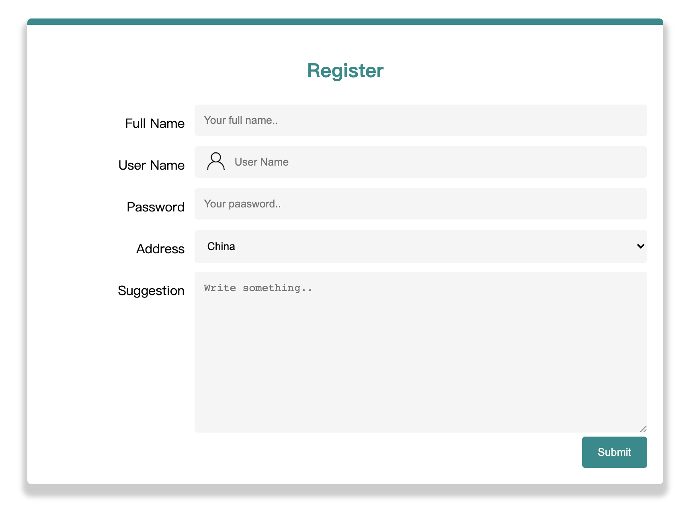
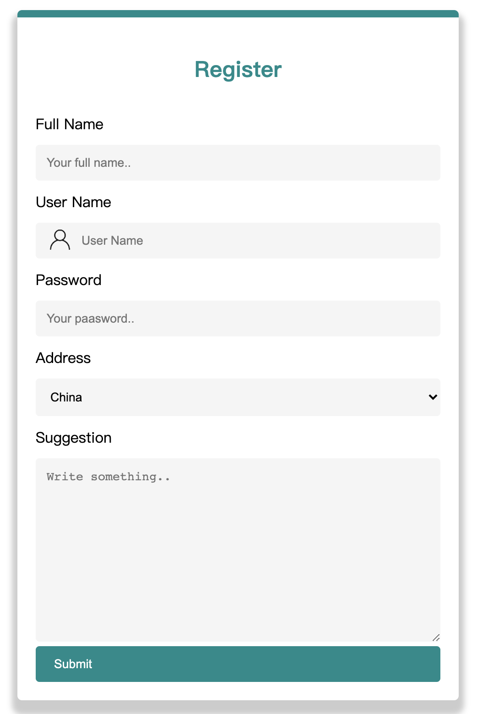

- 当屏幕的宽度大于 600 像素时，表单每行显示两列，当屏幕的宽度小于 600 像素时，使两列上下堆叠

- 调节浏览器宽度，所有表单元素(输入框，下拉列表框，多行输入框)自适应改变宽度。

- 屏幕的宽度小于 600 像素时，`Register`标题由中间对齐变成左对齐。

- 思考如何设置各表单元素宽度单位，实现宽度根据浏览器窗口大小改变而改变。

- 编写合适的 CSS 规则集，给表单盒子添加阴影效果，圆角边框,改变上边框颜色为`#008b8b`,添加合适的内边距和外边距

- 表单所有元素的`box-sizing`距设置为边框盒子。

- 编写 CSS 美化输入框，使用属性选择器定位输入框,改变背景颜色为`whitesmoke`,添加圆角，去掉外边框

- 结合合适的选择器实现鼠标点中输入框，改输入框放大1的像素的效果.

- 编写合适的 CSS 规则集，使用属性选择器定位用户名输入框，给用户名输入框添加一个

  用户图片logo (opens new window)

  在输入框的左侧，

  - 由于我们给出的图片logo尺寸比较大，你需要编写合适的 CSS规则控制其尺寸大小和位置与输入框尺寸相匹配
  - 重新设置合适的内边距让输入内容不被添加的[用户图片logo (opens new window)](https://b.bdstatic.com/searchbox/icms/searchbox/img/user的副本.png)所遮挡住。

- 编写合适的 CSS 规则集,美化多行输入框，实现宽度不可更改，只能让用户纵向改变尺寸

- 使用属性选择器定位按钮,给表单按钮上下内边距为12像素，左右内边距为20像素,为按钮提供`#008b8b`背景，白色字体，无边框和4像素的圆角,右浮动。

  **示例图1**

**示例图2**

